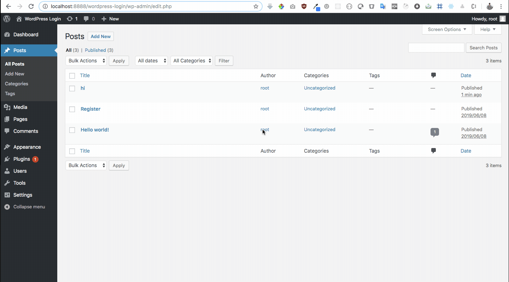
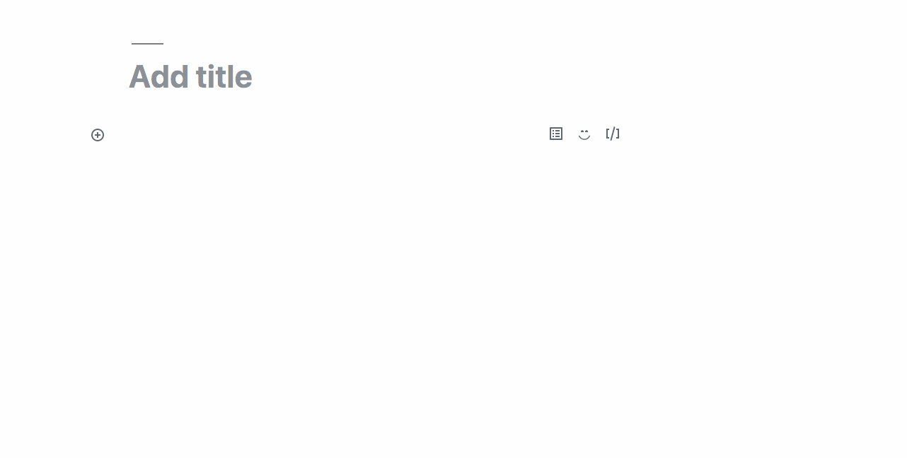

## Description

This plugin adds a different Gutenberg blocks in the Gutenberg editor of your WordPress dashboard. 

## Features :clipboard:

1. One Stop shop for learning Gutenberg
2. Gutenbeg Blogs and Video Tutorial Links
3. Gutenberg Example Plugins.


## Installation :wrench:

1. Download the zipped plugin. Unzip the plugin.
2. Navigate to the __Plugins > Add new__ screen in your WordPress administrative dashboard.
3. Click __Add New__ at the top of the page.
3. Click __Upload Plugin__ at the top of the page.
4. Click __Choose File__, then find and __Upload__ the downloaded renamed zip file.
5. After the plugin finishes installing, click __Activate__.

   or,
   Go to your plugin directory from terminal and Clone this repo in wp-content/plugins directory `git clone https://github.com/imranhsayed/gutenberg-workshop`
   And then activate it from __Plugins__ screen in your WordPress administrative dashboard.
6. That's it!

## Configuration ( @wordpress/scripts )

- This plugin uses [@wordpress/scripts](https://developer.wordpress.org/block-editor/packages/packages-scripts/) which installs and sets up webpack and babel config out of the box
- The `@wordpress/scripts` is installed in the root of the project. This is one single plugin that registers many blocks.
- By default `@wordpress/package` uses `src/index.js` as entry point and `build/index.js` 
- However we have also created custom scripts by overriding the defaults.
- Example `npm run build:dynamic-block` will use the `dynamic-block/assets/js/block.js` as entry point and output it to `dynamic-block/build/main.js`
- Each directory like `dynamic-block` register their own block. Only the bundling happens from the root.

## Directory Structure

```ruby
	-assets
		-css
		-js
			-block.js
	-build
		-main.js
	-inc
		-block-templates
		-class-register-block.php
	-helpers
		-custom-functions.php
	-index.php						
```

## Scripts

1. `build:dynamic-block` : will use the `dynamic-block/assets/js/block.js` as entry point and output it to `dynamic-block/build/main.js` for production
2. `build:dynamic-block-watch` : will use the `dynamic-block/assets/js/block.js` as entry point and output it to `dynamic-block/build/main.js` in watch mode for development

*Similarly Commands for creating bundle file ( JavasScript file ) for other blocks*

3. `build:dynamic-block-ssr` creates bundle file for dynamic-block-ssr block
4. `build:dynamic-block-ssr-watch` creates bundle file for dynamic-block-ssr block in watch mode.

5. `build:custom-category` creates bundle file for custom-category block
6. `build:custom-category-watch` creates bundle file for custom-category block in watch mode.


## Dynamic Block Demo :video_camera:



## Custom Category Demo :video_camera:


## What is included in this plugin ?

- The plugin uses ReactJS & ESNext for creating custom gutenberg block, along with PHP's OOP concept
- It uses Webpack to bundle all of its dependencies into one file index.js
- Has separate stylesheet for front-end & editor.

## Blocks Description :clipboard:

1. [custom-category](https://github.com/imranhsayed/gutenberg-workshop/tree/master/custom-category) Creates a custom catageory `GW Custom Blocks` and registers a block under the same category.

2. [dynamic-block](https://github.com/imranhsayed/gutenberg-workshop/tree/master/dynamic-block) Creates a dynamic block `Latest Posts`, that renders content as saved from the edit function in editor. 
The content that is returned by `render_callback()` is displayed on the front end. Here the editor content and front content can be different if you return different
content from `edit()` in block.js and `render_callback()` in php file. 

3. [dynamic-block-ssr](https://github.com/imranhsayed/gutenberg-workshop/tree/master/dynamic-block-ssr) Creates a dynamic block and returns the same content both in editor and front end, what is returned
by `render_callback()`, using `<ServerSideRender>`. The data that you pass in attributes of`<ServerSideRender attributes={{ name: 'Imran' }}>` will be available in `render_callback( $attributes )` in php.
You must define its type in the `register_block_type()`

## Useful Blogs:

1. [Create Gutenberg Block in 3 Steps](https://medium.com/@imranhsayed/create-gutenberg-block-in-3-steps-924828a2ff83)
2. [Custom Gutenberg Block with ES6](https://medium.com/@imranhsayed/custom-gutenberg-block-using-es6-webpack-babel-wordpress-scripts-7d6f185d9eb6)
3. [Attributes & Components](https://medium.com/@imranhsayed/attributes-and-components-in-gutenberg-blocks-richtext-blockcontrols-alignmenttoolbar-230910fcbd4a)

## Gutenberg Handbook

1. [Gutenberg Handbook](https://developer.wordpress.org/block-editor/)

## Gutenberg Tutorials

1. [Introduction to Gutenberg](https://youtu.be/U4sfx7vN0Iw)
2. [Create Gutenberg Block in 3 Steps](https://youtu.be/AQ10IGN2lt8)
3. [Custom Gutenberg Block using @wordpress/scripts](https://youtu.be/Pfp7mCXnhhw)
4. [@wordpress/scripts package features](https://youtu.be/wihGO8yR3Q8)
5. [Attributes and Components | State ](https://youtu.be/aH0u5NBDAeg)

## Gutenberg Talks

1. [WordCamp Pune: Introduction to Gutenberg](https://wordpress.tv/2019/06/25/imran-sayed-introduction-to-gutenberg/)

## How to use ?

- Go to WordPress Dashboard > Posts/Pages > Add New > Add block ( + icon ) > Layout Elements > Contact Card
- Now you can add your picture, name, subtitle, description, twitter link, facebook link and email.
- When you publish the post you can see this custom contact card block as a part of your post/page on dashboard as well as on front end.
- This gutenberg block is reusable so you can use it as many times as you want on a post or page to share your contact details.
